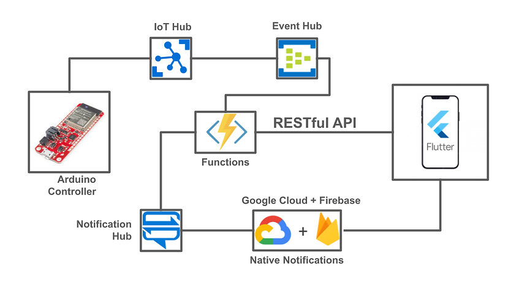
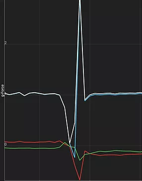

# uni-iot-project
Our project for the IoT workshop at Tel Aviv University.

# ARC - Automatically Recognize a Collapse
## About
Is there someone in your family that lives alone? It could be your grandfather, grandmother, father or mother. It could be worrying sometimes. We want our family members to be OK, and if something happens, we want to be aware of it so we can hurry and help them.

More than 30% of Israel's eldery community live alone. We set out to detect cases of emergency among them, and alert their families.

## Our Features
Meet ARC. The chest strap which alerts you when your family members are in trouble and helps you ensure that they are safe.

## Architecture
The following diagram shows how our system works end to end. Every technology was selected and developed with great care.

  

## Hardware
Every ARC accessory includes a SparkFun Thing Plus ESP32 board paired with a 3-axis accelerometer and a button. We sample the sensor and calculate the weighted acceleration value in a frequency of 100Hz.

Upon detection of exceptionally low acceleration values, we conclude that a fall has occurred and send telemetry to the server. 

The user may also manually trigger by pressing the button.

  

## Azure Services
### CosmosDB
We used an efficient and minimalistic db schema which manages users, devices and logs fall events. We make use of function bindings as well as manual DB actions, including the use of SQL expressions. There are connections between containers by partition id, which conveniently allow saving just pointers to other containers, without duplicating the actual data again and again.

### IoT and Event Hubs
IoT hub connects us between our physical IoT device and Azure cloud services. By registering a device to our ioT hub we route messages from ioT hub to event hub service. The event hub receives and processes the events sent from the app to send notifications and store the data for future use (AI, BI, etc.).

### Functions app: HTTP / Event Trigger / API Keys
Access to information, modification of it and dispatch of notifications are all achieved by calling the relevant function app. We used 2 types of functions: Event Trigger for a fall / emergency event, and HTTP Trigger for the mobile app API. 
The API itself is secured by using a master Admin API key, which only the app knows, so no one can send requests but the app itself.

### Azure Push Notifications Integration with Firebase/Google Cloud
This service allows us to catch an event without the need of the app to even be open in the foreground. The app will wake and alert the user, as well as show a conventional push notification.

## Mobile App
We built an elegant Android app that receives push notifications and alerts (with sound) whenever a fall / emergency event occurs. Even when the app is not open at all.
Paired with the RESTful API from Azure Functions, the app is fully capable of managing accounts, registering devices, and following other users’ events.

The Flutter SDK was used in order to ensure seamless future expansion to other platforms besides Android.

## What’s special about our code?
### Made with .NET
In order to ensure maximal support of Azure with our functions, they are written in .NET.

Well Built Code Architecture
In order to be maintainable and scalable, our code in all our projects is well written, commented and modulated, so anyone can read the code and with a little bit of knowledge on the platforms, they can understand what’s happening and get right to work.

### Robustness
Making sure the apps do not crash on any input is crucial. We strive for robustness in the general sense, and to date all bugs have been taken care of.

## Our Team
This project was submitted by Re'em Kishinevsky, Yuval Cohen and David Molina.
We are students in Tel Aviv Unitersity, studying for B.Sc in Computer Science.
The workshop was guided by Sivan Toledo, Nir Levy and Moab Arar.
August 29th, 2022.

  
   
  

## Git
<https://github.com/ReemKish/uni-iot-project.git>

## Contact
<davidmolina@mail.tau.ac.il>
<reemkishinevsky@gmail.com>
<yuvalc2@mail.tau.ac.il>
